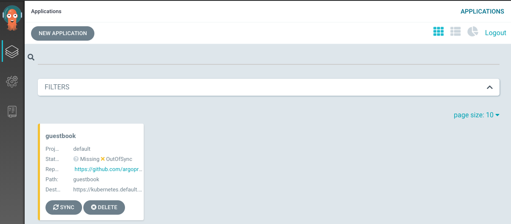
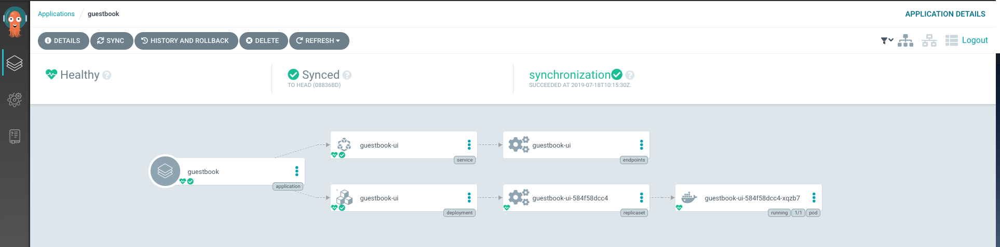
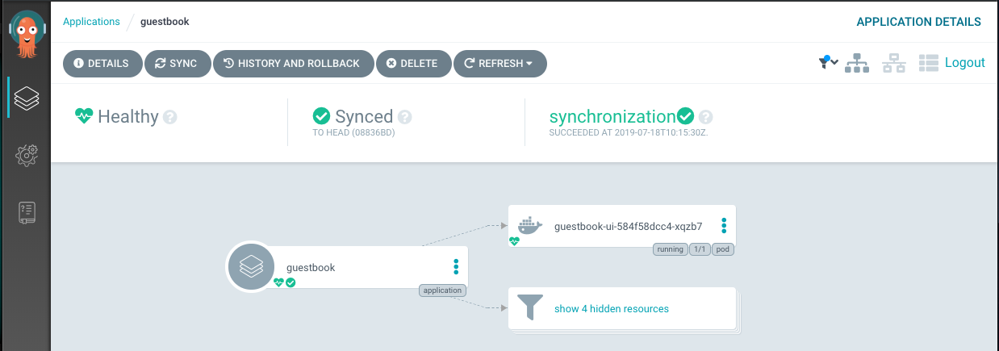

# argo-cd-local
Original document is [Getting Started](https://argoproj.github.io/argo-cd/getting_started/#getting-started).

## Settings
### Create namespace
```bash
$ kubectl create namespace argocd
$ kubectl config set-context docker-for-desktop/argocd --cluster=docker-for-desktop-cluster --user=docker-for-desktop --namespace=argocd
Context "docker-for-desktop/argocd" created.
$ kubectx docker-for-desktop/argocd
switched to context "docker-for-desktop/argocd".
```
### Install Argo CD
```bash
$ kubectl apply -n argocd -f https://raw.githubusercontent.com/argoproj/argo-cd/stable/manifests/install.yaml
$ kubectl get all

NAME                                                READY   STATUS    RESTARTS   AGE
pod/argocd-application-controller-f67459c88-t6fwf   1/1     Running   2          2m
pod/argocd-dex-server-684c85874-rtl4j               1/1     Running   1          2m
pod/argocd-redis-858cddfbcd-tv779                   1/1     Running   0          2m
pod/argocd-repo-server-6f5d4b7b67-dfq98             1/1     Running   0          2m
pod/argocd-server-565f654978-668ml                  1/1     Running   0          2m
NAME                            TYPE        CLUSTER-IP       EXTERNAL-IP   PORT(S)             AGE
service/argocd-dex-server       ClusterIP   10.111.19.29     <none>        5556/TCP,5557/TCP   2m
service/argocd-metrics          ClusterIP   10.111.237.139   <none>        8082/TCP            2m
service/argocd-redis            ClusterIP   10.101.213.66    <none>        6379/TCP            2m
service/argocd-repo-server      ClusterIP   10.109.223.250   <none>        8081/TCP,8084/TCP   2m
service/argocd-server           ClusterIP   10.105.86.131    <none>        80/TCP,443/TCP      2m
service/argocd-server-metrics   ClusterIP   10.98.88.13      <none>        8083/TCP            2m
NAME                                            DESIRED   CURRENT   UP-TO-DATE   AVAILABLE   AGE
deployment.apps/argocd-application-controller   1         1         1            1           2m
deployment.apps/argocd-dex-server               1         1         1            1           2m
deployment.apps/argocd-redis                    1         1         1            1           2m
deployment.apps/argocd-repo-server              1         1         1            1           2m
deployment.apps/argocd-server                   1         1         1            1           2m
NAME                                                      DESIRED   CURRENT   READY   AGE
replicaset.apps/argocd-application-controller-f67459c88   1         1         1       2m
replicaset.apps/argocd-dex-server-684c85874               1         1         1       2m
replicaset.apps/argocd-redis-858cddfbcd                   1         1         1       2m
replicaset.apps/argocd-repo-server-6f5d4b7b67             1         1         1       2m
replicaset.apps/argocd-server-565f654978                  1         1         1       2m
```

### Install `argocd` command
```bash
$ brew tap argoproj/tap
$ brew install argoproj/tap/argocd
$ which argocd
```

### Access Server
```bash
$ kubectl port-forward svc/argocd-server -n argocd 8080:443
```

#### login
##### get password
```bash
$ kubectl get pods -n argocd -l app.kubernetes.io/name=argocd-server -o name | cut -d'/' -f 2
```
##### login
```bash
$ argocd login localhost:8080
WARNING: server certificate had error: x509: certificate signed by unknown authority. Proceed insecurely (y/n)? y
Username: admin
Password:
'admin' logged in successfully
Context 'localhost:8080' updated
```

and login in http://localhost:8080

## Create App via CLI
```bash
$ argocd app create guestbook \
  --repo https://github.com/argoproj/argocd-example-apps.git \
  --path guestbook \
  --dest-server https://kubernetes.default.svc \
  --dest-namespace default
application 'guestbook' created
```



```bash
$ argocd app get guestbook
Name:               guestbook
Project:            default
Server:             https://kubernetes.default.svc
Namespace:          default
URL:                https://localhost:8080/applications/guestbook
Repo:               https://github.com/argoproj/argocd-example-apps.git
Target:
Path:               guestbook
Sync Policy:        <none>
Sync Status:        OutOfSync from  (08836bd)
Health Status:      Missing

GROUP  KIND        NAMESPACE  NAME          STATUS     HEALTH
apps   Deployment  default    guestbook-ui  OutOfSync  Missing
       Service     default    guestbook-ui  OutOfSync  Missing
```

### Sync App
```bash
$ argocd app sync guestbook
```
See: https://localhost:8080/applications/guestbook


Entities can be filterd.
(e.g. pod only)

